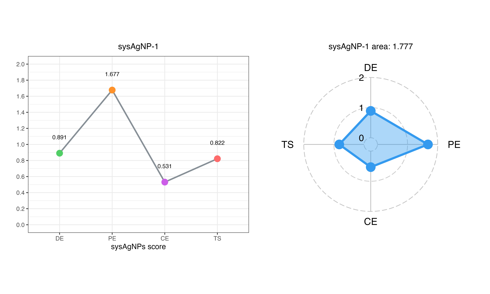

# sysAgNPs <a href="https://xitingwang-ida.github.io/sysAgNPs/"></a>

## Introduction

There is variation across AgNPs due to differences in characterization techniques and testing metrics employed in studies. To address this problem, we have developed a systematic evaluation framework called "sysAgNPs". Within this framework, Distribution Entropy (DE) is utilized to measure the uncertainty of AgNPs' feature categories, Proclivity Entropy (PE) assesses the preference of these categories, and Combination Entropy (CE) quantifies the uncertainty of feature combinations of AgNPs. Additionally, a Markov chain model is employed to examine the relationships among the sub-features of AgNPs and to determine a Transition Score (TS) scoring standard that is based on steady-state probabilities. The sysAgNPs framework provides metrics for evaluating AgNPs, which helps to unravel their complexity and facilitates effective comparisons among different AgNPs, thereby advancing the scientific research and application of these nanoparticles.

## Installation of sysAgNPs package

```R
# Install sysAgNPs from Bitbucket
install.packages("devtools")
library(devtools)
devtools::install_github("xitingwang-ida/sysAgNPs")

# Load sysAgNPs
library(sysAgNPs)
```

## How to use sysAgNPs to evaluate AgNPs data
All the approaches of sysAgNPs are implemented as a software package that handles all the different steps of the framework creation process and makes it easy to evaluate AgNPs experimental data by adjusting a few parameters.

### Build Transition Score criteria

```R
# Import AgNPs dataset to build Transition Score criteria
data(dataset)

# Select the columns to be discretized
var_dis <- c("Synthesis methods", "pH", "Temperature (℃)", "Zeta potential (mV)","Size (nm)", "Shape", "Applications")

# Convert categorical variables into discrete variables
dis_data <- sys_discretize(dataset, var_dis)

# Build markov chain and calculate transition matrix
tran_matrix <- sys_tran(dis_data)

# Obtain the relationship between the number of iterations and tolerance
tol_iter <- sys_steady(dis_data, tran_matrix)

# Loop "n_iter" times to count the results of each iteration. The final steady-state result is reached when the number of iterations is "n_iter"

iter_prob <- sys_iter(dataset, 6, var_dis)

# Export the Transition Score criteria
TS_criteria <- sys_eval_cri(dataset, 6, var_dis)
# Save Transition Score criteria
rio::export(TS_criteria,"inst/extdata/TS_criteria.xlsx")
```

### Evaluate the experimental data of AgNPs

```R
# Import and evaluate the experimental data
data(dataset)
users_data <- dataset

# Calculate the Distribution Entropy
DE <- sys_DE(users_data)

# Calculate the Proclivity Entropy
PE <- sys_PE(users_data)

# Calculate the Combination Entropy
CE <- sys_CE(users_data, dataset)

# Transition score
T_S <- sys_TS(users_data, dataset, 6, var_dis)

# sysAgNPs score of AgNPs (DE, PE, CE, TS)
sysAgNPs_score <- data.frame(DE = DE$H_pB,
                             PE = PE$H_pK,
                             CE = CE$H_pE,
                             TS = T_S$TS)

# Save sysAgNPs score results
rio::export(sysAgNPs_score, "inst/extdata/sysAgNPs_score.xlsx")

# Line and radar plots of sysAgNPs score                            
sysAgNPs_line_radar_1 <- sys_line_radar(sysAgNPs_score, 1)
# sysAgNP1
sysAgNPs_line_radar_1
```
<!-- -->

## Session information
```R
sessionInfo()
# R version 4.4.0 (2024-04-24)
# Platform: aarch64-apple-darwin20
# Running under: macOS Sonoma 14.4.1
# 
# Matrix products: default
# BLAS:   /System/Library/Frameworks/Accelerate.framework/Versions/A/Frameworks/vecLib.framework/Versions/A/libBLAS.dylib 
# LAPACK: /Library/Frameworks/R.framework/Versions/4.4-arm64/Resources/lib/libRlapack.dylib;  LAPACK version 3.12.0
# 
# locale:
# [1] en_US.UTF-8/en_US.UTF-8/en_US.UTF-8/C/en_US.UTF-8/en_US.UTF-8
# 
# time zone: Asia/Shanghai
# tzcode source: internal
# 
# attached base packages:
# [1] stats     graphics  grDevices utils     datasets  methods   base     
# 
# other attached packages:
#  [1] expm_0.999-9    Matrix_1.7-0    magrittr_2.0.3  lubridate_1.9.3 forcats_1.0.0   stringr_1.5.1  
#  [7] dplyr_1.1.4     purrr_1.0.2     readr_2.1.5     tidyr_1.3.1     tibble_3.2.1    ggplot2_3.5.1  
# [13] tidyverse_2.0.0 rio_1.1.1      
# 
# loaded via a namespace (and not attached):
#  [1] gtable_0.3.5      xfun_0.44         htmlwidgets_1.6.4 devtools_2.4.5    remotes_2.5.0    
#  [6] processx_3.8.4    lattice_0.22-6    callr_3.7.6       tzdb_0.4.0        vctrs_0.6.5      
# [11] tools_4.4.0       ps_1.7.6          generics_0.1.3    fansi_1.0.6       pkgconfig_2.0.3  
# [16] R.oo_1.26.0       desc_1.4.3        readxl_1.4.3      lifecycle_1.0.4   compiler_4.4.0   
# [21] munsell_0.5.1     httpuv_1.6.15     htmltools_0.5.8.1 usethis_2.2.3     yaml_2.3.8       
# [26] later_1.3.2       pillar_1.9.0      pkgdown_2.0.9     crayon_1.5.2      urlchecker_1.0.1 
# [31] ellipsis_0.3.2    R.utils_2.12.3    cachem_1.1.0      sessioninfo_1.2.2 mime_0.12        
# [36] tidyselect_1.2.1  digest_0.6.35     stringi_1.8.4     rprojroot_2.0.4   fastmap_1.2.0    
# [41] grid_4.4.0        colorspace_2.1-0  cli_3.6.2         pkgbuild_1.4.4    utf8_1.2.4       
# [46] withr_3.0.0       scales_1.3.0      promises_1.3.0    writexl_1.5.0     timechange_0.3.0 
# [51] rmarkdown_2.27    cellranger_1.1.0  R.methodsS3_1.8.2 hms_1.1.3         memoise_2.0.1    
# [56] shiny_1.8.1.1     evaluate_0.23     knitr_1.47        miniUI_0.1.1.1    profvis_0.3.8    
# [61] rlang_1.1.4       Rcpp_1.0.12       xtable_1.8-4      glue_1.7.0        pkgload_1.3.4    
# [66] rstudioapi_0.16.0 R6_2.5.1          fs_1.6.4
```
